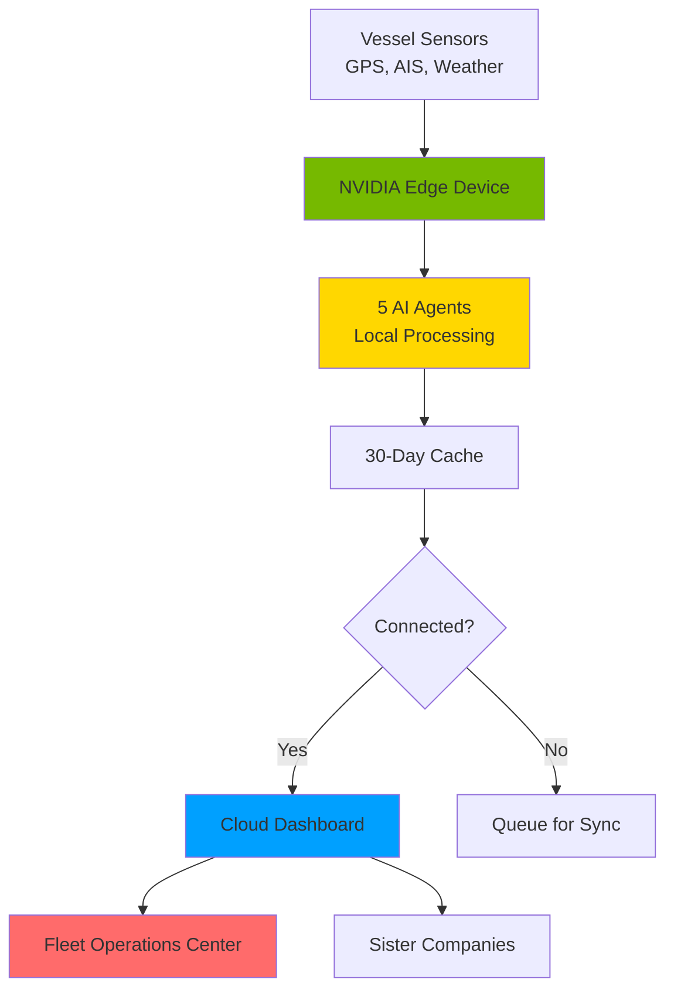

---

# Maritime AI Dashboard

**Digital Twin of the Oceans**

Vessel Intelligence & Safety System

  
    Press Space for next page <carbon:arrow-right class="inline"/>
  

  Live Demo: http://localhost:3001

---
transition: fade-out
layout: two-cols
---

# The Challenge

<v-clicks>

**Maritime vessels operate in harsh, disconnected environments**

- 🌊 **30+ days** without internet connectivity
- ⚠️ **Critical incidents** require immediate response
- 📡 **Limited communication** with shore operations
- 🛠️ **Complex compliance** requirements (IMO, MARPOL, SOLAS)
- 💰 **High operational costs** (fuel, insurance, downtime)

</v-clicks>

::right::

<v-clicks>

# Our Solution

**Offline-first AI platform with autonomous agents**

- 🤖 **5 AI Agents** per vessel (Weather, Navigation, Incident, Compliance, Comms)
- 📶 **30+ day offline operation** with local processing
- 🎯 **Edge Computing** on NVIDIA Jetson hardware
- 🌐 **Multi-org network** for data sharing
- 🎤 **Voice-first interface** for hands-free operation

</v-clicks>

---
layout: center
class: text-center
---

# System Architecture

---

# Technology Stack

## Frontend Dashboard
- **Next.js 15** + TypeScript
- **Tailwind CSS** styling
- **OpenLayers 10.6** maps
- **Recharts** visualization

Built on OpenSeaMap (1,683 lines PHP, 17 APIs)

## Data Sources & Edge
- **Weather:** Stormglass.io, Open-Meteo
- **Regulations:** SOLAS chapters database
- **Tracking:** AIS + GMDSS
- **Edge AI:** NVIDIA Jetson
- **Local LLM:** Llama/Mistral

---
layout: image-right
image: https://images.unsplash.com/photo-1530669378-5c8f1e0ff1e0?w=800&q=80
---

# LIVE DEMO: Fleet Overview

**🌐 [localhost:3001](http://localhost:3001)**

### What You'll See

<v-clicks>

- **12 vessels** real-time status
- **Fleet statistics** panel
- **Connectivity** 🟢 🟡 🔴
- **Fuel level** warnings
- **Click vessel** for details

</v-clicks>

### Key Features

<v-clicks>

- Auto-refresh (5 sec)
- Color-coded status
- GPS coordinates
- Speed & heading
- Destination & ETA

</v-clicks>

---

# LIVE DEMO: Incident Management

**Switch to Incidents Tab** 👉 [localhost:3001](http://localhost:3001)

## 8 Incident Types

<v-clicks>

- 🌪️ Weather
- 🏴‍☠️ Criminal
- 🗺️ Geopolitical
- 💰 Financial
- ⚙️ Mechanical
- 🏥 Medical
- 🛢️ Environmental
- ⚠️ Dangerous

</v-clicks>

## Features

<v-clicks>

- **Severity** (1-5 color)
- **Status filtering**
- **Type filtering**
- **AI Recommendations**
- **Location data**
- **Damage tracking**
- **Timestamps**

</v-clicks>

---

# LIVE DEMO: OpenSeaMap

**Check out the Map Tab** 👉 [localhost:3001](http://localhost:3001)

## Map Layers

<v-clicks>

- **Base OSM** tiles
- **Seamark** overlays
- **Weather** layer
- **Route Trails** (1h-7d)
- **Incident** markers
- **Measurement** tools

</v-clicks>

## Try It!

<v-clicks>

- Click vessels
- Toggle weather
- Measure distance
- Zoom & pan

</v-clicks>

---

# LIVE DEMO: Vessel Details

**Click any vessel card** 👉 [localhost:3001](http://localhost:3001)

## Vessel Info

<v-clicks>

**Status & Position**
- Connectivity
- Speed & heading
- GPS coordinates
- Destination & ETA

**Operational**
- Crew count
- Fuel level gauge
- Type & flag
- IMO & MMSI

</v-clicks>

## Intelligence

<v-clicks>

**Weather**
- Temp, pressure
- Wind, waves
- Visibility

**5 AI Agents**
- Weather
- Navigation
- Incident Response
- Compliance
- Communication

</v-clicks>

---

# AI Agent Capabilities

**Three core AI functions powered by real maritime data**

## 1. Auto-Populate Checklists

- Pre-departure templates
- Equipment vs SOLAS
- Sensor data integration

**Data:** SOLAS regs + vessel sensors

## 2. Route Optimization

- Weather forecast monitoring
- Hazard avoidance
- Alternative routing

**Data:** Weather APIs + AIS

## 3. Compliance Monitoring

- Certificate expiration
- Crew rest hours
- Emission reporting

**Data:** SOLAS + cert database

---

# Offline-First Architecture

**Critical for 30+ days without connectivity**

## How It Works

<v-clicks>

1. **Local Processing** - NVIDIA edge
2. **30-Day Cache** - Local storage
3. **Queue Sync** - Smart priority
4. **Confidence Scores** - Freshness
5. **Manual Override** - Captain control

</v-clicks>

## Data Priority

<v-clicks>

**P1:** Position, speed, status

**P2:** Route deviations

**P3:** Incidents

**P4:** Weather/oceanic

**P5:** Route updates

</v-clicks>

---
layout: two-cols
---

# Key Differentiators

<v-clicks>

## Why We're Unique

1. **Offline-First**
   - Only maritime platform designed for 30+ days offline

2. **AI Agent Autonomy**
   - 5 specialized agents per vessel

3. **Edge Computing**
   - NVIDIA-powered local processing

</v-clicks>

::right::

<v-clicks>

4. **Sister Company Network**
   - Industry-first multi-org sharing

5. **Audio-First Interface**
   - Hands-free voice commands

6. **Digital Twin Testing**
   - Safe agent behavior simulation

</v-clicks>

---

# Development Roadmap

<v-clicks>

## Phase 1: MVP (M1-4) → $300K-$500K
Single vessel, dashboard, incident reporting
**Success:** 1 vessel, 24h offline

## Phase 2: Multi-Vessel (M5-8) → $400K-$600K
Fleet mgmt, advanced agents
**Success:** 10 vessels, 30d offline

## Phase 3: Digital Twin (M9-12) → $350K-$550K
Simulation, analytics, multi-tenant
**Success:** 100+ vessels, ROI

## Phase 4: Scale (M13-18) → $450K-$700K
Multi-org, mobile apps, marketplace
**Success:** 1,000+ vessels

</v-clicks>

---

# Success Metrics

## Operational

- ⏱️ **< 5 min** response
- ⛽ **10%** fuel gain
- ⬇️ **50%** less downtime
- ✅ **100%** compliance

## Technical

- 🟢 **99.9%** uptime
- 🤖 **99.5%** accuracy
- 📶 **30+ days** offline
- ⚡ **< 5 sec** decisions

## Business

- 😊 **NPS > 50**
- 💰 **18mo** ROI
- 🚢 **100+** vessels
- 🛡️ **15%** insurance↓

Safety: 30% ↓ incidents • Zero injuries • 20% ↓ emissions

---

# Real-World Use Case: Heavy Weather

**Scenario:** Vessel encounters Beaufort 9 storm (6m waves)

## AI Auto-Checklist

- **Auto-generated** from SOLAS templates
- **80% pre-filled** from sensors
- Close watertight doors ✓
- Secure cargo lashings ✓
- Ballast adjustment ✓
- Dual steering engaged ✓
- Weather routing suggested
- Crew rest monitoring active

## Captain Testimonial

> *"System pulled up heavy weather checklist automatically. Sensor data pre-checked most items. We focused on critical decisions, not paperwork."*
>
> — Chief Officer

**Result:**
- 5 min response time
- Zero cargo damage
- Full SOLAS compliance
- Complete audit trail

---

# Investment & ROI

## Investment
**$1.5M - $2.35M** / 18mo

- Phase 1: $300K-$500K
- Phase 2: $400K-$600K
- Phase 3: $350K-$550K
- Phase 4: $450K-$700K

## Returns

- **10%** fuel savings
- **15%** insurance ↓
- **30%** fewer incidents
- **50%** less downtime
- Avoid fines

**ROI:** 18mo @ 100+ vessels

---

# Security & Compliance

## Security

- **Encryption:** AES-256, TLS 1.3
- **Access:** RBAC, MFA, audit logs
- **Edge:** Docker isolation, VPN

## Compliance

**Maritime:** IMO SOLAS, ISM, MARPOL

**Privacy:** GDPR, CCPA

**Standards:** ISO 9001, 27001, NMEA

---

# Current Status & Next Steps

## ✅ Completed

<v-clicks>

- Fleet dashboard
- Incident management
- OpenSeaMap integration
- Weather overlays
- Route tracking
- Vessel details
- Measurement tools
- Dark mode
- TypeScript

</v-clicks>

## 🚀 Next Steps

<v-clicks>

1. Stakeholder review
2. Technical validation
3. Pilot program (3-5 vessels)
4. Partnerships (NVIDIA)
5. Funding (18 months)
6. Team assembly

</v-clicks>

---
layout: center
class: text-center
---

# Let's Build the Digital Twin of the Oceans

### Live Demo
**Dashboard**: [localhost:3001](http://localhost:3001)

### Resources
- **GitHub**: OpenSeaMap/online_chart
- **Docs**: PRD.md, VESSEL_AGENT_SPEC.md

### Contact
[Your Name]
[Your Email]
[Your Company]

### Shortcuts
- **'o'** - Overview
- **'d'** - Dark mode

  Questions?

